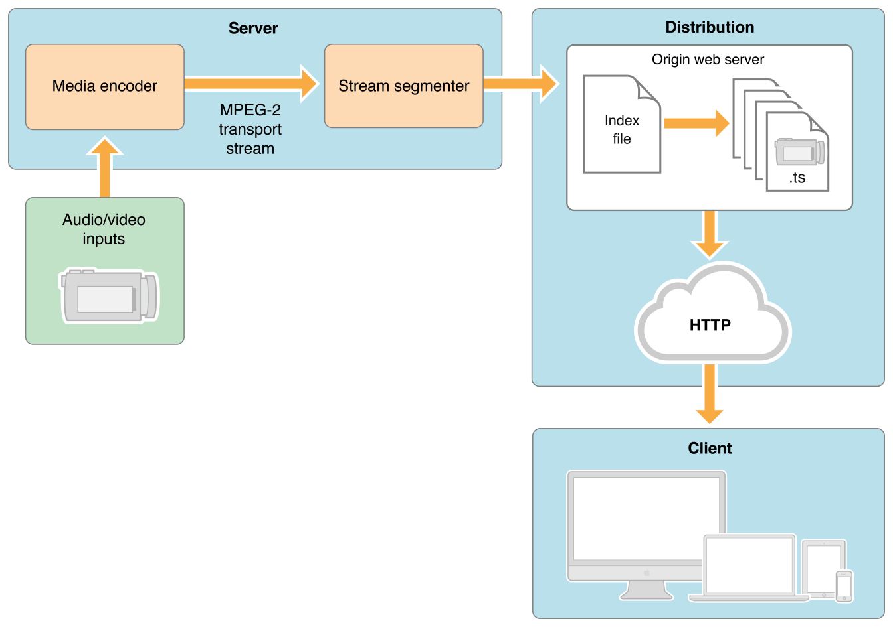

## Informe HLS 

- **Autores:** [Amador Carmona Méndez y Cheikhna Ibrahim Diagana Alejo]
- **Asignatura:** [Transmision de Datos y Redes de Computadores]
- **Fecha:** [30/04/2024]

---

### ➢ ¿Qué es y para qué sirve HLS?

HLS (HTTP Live Streaming) es un protocolo de transmisión de video y audio basado en HTTP desarrollado por Apple Inc. y lanzado en 2009. Se utiliza para entregar contenido multimedia en vivo y a demanda a través de Internet.

HLS se utiliza para una amplia variedad de aplicaciones, incluyendo:

- Transmisión de video en vivo: HLS es ideal para transmitir eventos en vivo, como conciertos, partidos deportivos y noticias.
- Entrega de video a demanda (VOD): HLS también se puede utilizar para entregar contenido VOD, como películas, programas de televisión y videos musicales.
- Adaptación de bitrate: HLS permite que los dispositivos del cliente adapten la calidad de la transmisión en función de las condiciones de la red.
- Reproducción multiplataforma: HLS es compatible con una amplia gama de dispositivos, incluyendo smartphones, tabletas, computadoras de escritorio y televisores inteligentes.

**Referencias:**

[Wikipedias](https://en.wikipedia.org/wiki/HTTP_Live_Streaming),
[Datacasr](https://www.dacast.com/support/knowledgebase/what-is-hls-streaming/),
[Cloudflare](https://www.cloudflare.com/learning/video/what-is-http-live-streaming/),
[Apple Developer](https://developer.apple.com/streaming/)

---

### ➢¿Quién propuso por primera vez HLS?

No hay una única persona a la que se le atribuya la propuesta inicial de HLS. El desarrollo de HLS fue un esfuerzo colaborativo entre varios ingenieros y científicos de Apple Inc.

Apple presentó por primera vez HLS en 2009 como parte de su plataforma iOS. Desde entonces, HLS se ha convertido en un estándar de la industria para la transmisión de video en vivo y a demanda.

Varios contribuyentes clave al desarrollo de HLS incluyen:

- Phil Mulkey: Un ingeniero de Apple que jugó un papel fundamental en el diseño y la implementación de HLS.
- Brian Fenaughty: Un científico investigador de Apple que contribuyó al desarrollo de los algoritmos de adaptación de bitrate de HLS.
- Ken Fritton: Un arquitecto de software de Apple que trabajó en la integración de HLS con los reproductores multimedia de Apple.

Es importante destacar que HLS es un protocolo abierto y que varias empresas e individuos han contribuido a su desarrollo desde su lanzamiento inicial.

[Wiipedia](https://en.wikipedia.org/wiki/HTTP_Live_Streaming),
[Apple](https://developer.apple.com/streaming/)

---

### ➢Conceptualmente, ¿cuál es la estructura (diagrama de bloques) de HLS?

HLS (HTTP Live Streaming) se basa en una arquitectura cliente-servidor, donde el servidor empaqueta el contenido multimedia en segmentos de archivo y los entrega al cliente a través de HTTP. El cliente luego ensambla los segmentos para reproducir el contenido.

#### Diagrama conceptual de HLS:

**Elementos clave del diagrama:**

- **Cliente HLS:** El software que se ejecuta en el dispositivo del usuario final y que es responsable de descargar, ensamblar y reproducir el contenido multimedia.
- **Servidor HLS:** El software que se ejecuta en un servidor web y que es responsable de empaquetar el contenido multimedia en segmentos de archivo y entregarlos al cliente.
- **Segmentos de archivo:** Archivos de tamaño pequeño que contienen una parte del contenido multimedia.
- **Lista de reproducción de medios:** Un archivo de texto que contiene información sobre los segmentos de archivo y cómo ensamblarlos.
- **Protocolo HTTP:** El protocolo utilizado para transferir los segmentos de archivo y la lista de reproducción de medios desde el servidor al cliente.

**Funcionamiento de HLS:**

1. El cliente HLS solicita al servidor HLS una lista de reproducción de medios.
2. El servidor HLS envía la lista de reproducción de medios al cliente.
3. El cliente HLS analiza la lista de reproducción de medios para identificar los segmentos de archivo que necesita.
4. El cliente HLS solicita al servidor HLS cada segmento de archivo individual.
5. El servidor HLS envía cada segmento de archivo al cliente.
6. El cliente HLS ensambla los segmentos de archivo para reproducir el contenido multimedia.

**Adaptación de bitrate:**

Una de las características clave de HLS es la adaptación de bitrate. Esto significa que el cliente HLS puede ajustar la tasa de bits de la transmisión en función de las condiciones de la red.

**Ventajas de la estructura de bloques de HLS:**

- **Simplicidad:** La estructura de bloques de HLS es simple y fácil de entender.
- **Flexibilidad:** La estructura de bloques de HLS es flexible y se puede adaptar a una amplia variedad de aplicaciones.
- **Escalabilidad:** La estructura de bloques de HLS es escalable y puede manejar grandes cantidades de tráfico.
- **Fiabilidad:** La estructura de bloques de HLS es fiable y proporciona una experiencia de reproducción fluida.

**Desventajas de la estructura de bloques de HLS:**

- **Latencia:** La estructura de bloques de HLS puede tener una latencia más alta que otros protocolos de transmisión de video.
- **Overhead:** La estructura de bloques de HLS puede tener una sobrecarga más alta que otros protocolos de transmisión de video.

**En general, la estructura de bloques de HLS es una arquitectura robusta y versátil que hace de HLS una opción popular para la transmisión de video en vivo y a demanda.**

**Referencias:**

[Wikipedia](https://en.wikipedia.org/wiki/HTTP_Live_Streaming),
[Datacast](https://www.dacast.com/support/knowledgebase/what-is-hls-streaming/),
[Cloudfare](https://www.cloudflare.com/learning/video/what-is-http-live-streaming/)

---

### ➢¿Cómo prepara el servidor el contenido multimedia?

#### Preparación del contenido multimedia para HLS

En el contexto de HLS (HTTP Live Streaming), el servidor juega un papel crucial en la preparación del contenido multimedia para su entrega eficiente a los clientes. Este proceso implica varios pasos esenciales:

1. **Empaquetado de contenido:**

- El servidor recibe el contenido multimedia original, que puede estar en formato de video, audio o ambos.
- El contenido se divide en segmentos de archivo más pequeños, típicamente de 3 a 10 segundos de duración.
- Cada segmento se codifica en múltiples bitrates, utilizando diferentes códecs de video y audio para adaptarse a las condiciones de la red y los dispositivos del cliente.
- Los segmentos codificados se encapsulan en archivos de formato MPEG-2 Transport Stream (TS) o Fragmented MP4 (fMP4).

2. **Creación de la lista de reproducción de medios:**

- El servidor genera una lista de reproducción de medios, un archivo de texto que contiene información sobre los segmentos de archivo y cómo ensamblarlos para reproducir el contenido.
- La lista de reproducción de medios incluye la ubicación de cada segmento, su bitrate, duración y otros metadatos relevantes.
- La lista de reproducción de medios se actualiza periódicamente para reflejar los nuevos segmentos que se van codificando.

3. **Almacenamiento y entrega:**

- Los segmentos de archivo y la lista de reproducción de medios se almacenan en un servidor web accesible para los clientes.
- Cuando un cliente solicita el contenido multimedia, el servidor envía la lista de reproducción de medios al cliente.
- El cliente analiza la lista de reproducción de medios para identificar los segmentos de archivo que necesita y los solicita al servidor.
- El servidor envía los segmentos de archivo al cliente, que los ensambla para reproducir el contenido.

**Optimizaciones para HLS:**

- Fragmentación de segmentos: La fragmentación de contenido en segmentos pequeños permite una carga rápida y una reproducción fluida, incluso en redes congestionadas.
- Adaptación de bitrate: La codificación de múltiples bitrates permite al cliente seleccionar la tasa de bits más adecuada para su dispositivo y condiciones de red.
- Listas de reproducción de segmentos: Las listas de reproducción de segmentos proporcionan información detallada sobre el contenido, lo que facilita la búsqueda y la reproducción específica de partes del contenido.
- Cifrado: El cifrado del contenido protege la propiedad intelectual y evita el acceso no autorizado.

**Consideraciones adicionales:**

- El proceso de preparación del contenido multimedia puede variar según el tipo de contenido, los requisitos de calidad y las capacidades del servidor.
- Las herramientas de software especializadas pueden automatizar y optimizar la preparación del contenido multimedia para HLS.

En resumen, la preparación del contenido multimedia para HLS implica varios pasos clave que garantizan una entrega eficiente y una experiencia de reproducción fluida para los clientes.

**Referencias:**

[Wikipedia](https://en.wikipedia.org/wiki/HTTP_Live_Streaming),
[Datacast](https://www.dacast.com/support/knowledgebase/what-is-hls-streaming/),
[Cloudfare](https://www.cloudflare.com/learning/video/what-is-http-live-streaming/),
[Apple Developer](https://developer.apple.com/streaming/)

---

### ➢¿Qué es una lista de reproducción? ¿Cómo es su formato? Explica dicho formato.

#### ¿Qué es una lista de reproducción en HLS?

En el contexto de HLS (HTTP Live Streaming), una lista de reproducción es un archivo de texto que contiene información esencial para la reproducción de contenido multimedia. Funciona como un índice que describe los segmentos de archivo que componen el contenido y cómo deben ensamblarse para reconstruir la secuencia original.

#### Formato de la lista de reproducción

La lista de reproducción HLS está basada en formato M3U (Media Playlist). Su estructura se compone de varias secciones:

1. **Encabezado:**

- La primera línea debe incluir la directiva #EXTM3U para indicar que es una lista de reproducción M3U.
- Pueden seguir líneas opcionales con información general del contenido, como el título o la descripción.

2. **Segmentos:**

- Cada segmento se describe con una entrada individual, comenzando con la directiva #EXTINF.
- La directiva #EXTINF incluye la duración del segmento en segundos.
- A continuación, se especifica la URL del segmento de archivo.
- Pueden seguir líneas opcionales con metadatos adicionales del segmento, como el título o la descripción.

#### Ejemplo de formato:
~~~
    #EXTM3U
    #EXTM3U TITLE: Mi video HLS
    #EXTINF:10.000,Segmento 1
    https://segment.com/
    #EXTINF:5.500,Segmento 2
    https://segmento.ru/en/
    #EXTINF:12.300,Segmento 3
    https://www.thirdsegment.com/
    Estructura jerárquica
~~~

Las listas de reproducción HLS no admiten una estructura jerárquica nativa. Sin embargo, se pueden emplear técnicas para simular una jerarquía:

- **Listas de reproducción maestro:** Una lista de reproducción maestro puede incluir referencias a otras listas de reproducción, creando una estructura en niveles.
- **Grupos de segmentos:** Los segmentos pueden agruparse por características como bitrate o resolución, y cada grupo puede tener su propia lista de reproducción.
- **Software del reproductor:** El software del reproductor puede interpretar la estructura de las listas de reproducción y presentar el contenido de forma jerárquica al usuario.

**Ventajas de las listas de reproducción jerárquicas:**

- **Organización:** Facilitan la organización de contenido complejo en categorías o niveles.
- **Navegación:** Permiten al usuario navegar por el contenido de forma jerárquica y seleccionar elementos específicos.
- **Adaptación:** El reproductor puede adaptar la reproducción en función de las preferencias del usuario o las condiciones de la red.

**Desventajas de las listas de reproducción jerárquicas:**

- **Complejidad:** Su implementación puede ser más compleja y requerir software de reproductor más sofisticado.
- **Overhead:** Pueden generar un overhead adicional en la transmisión de datos.

En resumen, las listas de reproducción son un componente fundamental de HLS, proporcionando información crucial para la reproducción fluida de contenido multimedia. Si bien no admiten una estructura jerárquica nativa, existen técnicas para simularla y mejorar la organización y navegación del contenido.

**Referencias:**

[Wikipedia](https://en.wikipedia.org/wiki/HTTP_Live_Streaming)
[Dacast](https://www.dacast.com/support/knowledgebase/what-is-hls-streaming/)
[Cloudflare](https://www.cloudflare.com/learning/video/what-is-http-live-streaming/)
[Apple Developer](https://developer.apple.com/streaming/)

---

➢ **¿Cuáles son las responsabilidades del servidor web?**

**Responsabilidades del servidor web en HLS (HTTP Live Streaming)**

En el contexto de HLS (HTTP Live Streaming), el servidor web juega un papel crucial en la entrega eficiente de contenido multimedia a los clientes. Sus responsabilidades abarcan desde la preparación del contenido hasta la entrega real de los segmentos de archivo y las listas de reproducción.

**Responsabilidades principales del servidor web:**

1. **Preparación del contenido:**
   - **Empaquetado de contenido:** El servidor recibe el contenido multimedia original y lo divide en segmentos de archivo más pequeños, típicamente de 3 a 10 segundos de duración.
   - **Codificación:** Se codifica cada segmento en múltiples bitrates, utilizando diferentes códecs de video y audio para adaptarse a las condiciones de la red y los dispositivos del cliente.
   - **Encapsulación:** Los segmentos codificados se encapsulan en archivos de formato MPEG-2 Transport Stream (TS) o Fragmented MP4 (fMP4).
   - **Creación de listas de reproducción:** El servidor genera una lista de reproducción de medios, un archivo de texto que contiene información sobre los segmentos de archivo y cómo ensamblarlos para reproducir el contenido.

2. **Almacenamiento y entrega:**
   - **Almacenamiento:** Los segmentos de archivo y la lista de reproducción de medios se almacenan en un servidor web accesible para los clientes.
   - **Entrega de segmentos:** Cuando un cliente solicita el contenido multimedia, el servidor envía la lista de reproducción de medios al cliente.
   - **Entrega de la lista de reproducción:** El cliente analiza la lista de reproducción de medios para identificar los segmentos de archivo que necesita y los solicita al servidor.
   - **Entrega de segmentos individuales:** El servidor envía los segmentos de archivo al cliente, que los ensambla para reproducir el contenido.

3. **Optimización y seguridad:**
   - **Fragmentación de segmentos:** La fragmentación de contenido en segmentos pequeños permite una carga rápida y una reproducción fluida, incluso en redes congestionadas.
   - **Adaptación de bitrate:** La codificación de múltiples bitrates permite al cliente seleccionar la tasa de bits más adecuada para su dispositivo y condiciones de red.
   - **Listas de reproducción de segmentos:** Las listas de reproducción de segmentos proporcionan información detallada sobre el contenido, lo que facilita la búsqueda y la reproducción específica de partes del contenido.
   - **Cifrado:** El cifrado del contenido protege la propiedad intelectual y evita el acceso no autorizado.

**Consideraciones adicionales:**

- El proceso de preparación del contenido multimedia puede variar según el tipo de contenido, los requisitos de calidad y las capacidades del servidor.
- Las herramientas de software especializadas pueden automatizar y optimizar la preparación del contenido multimedia para HLS.
- El servidor web debe tener un ancho de banda y una capacidad de almacenamiento suficientes para manejar el volumen de tráfico esperado.

En resumen, el servidor web desempeña un papel fundamental en HLS, garantizando una entrega eficiente y una experiencia de reproducción fluida para los clientes.

**Referencias:**

[Wikipedia](https://en.wikipedia.org/wiki/HTTP_Live_Streaming)
[Dacast](https://www.dacast.com/support/knowledgebase/what-is-hls-streaming/)
[Cloudflare](https://www.cloudflare.com/learning/video/what-is-http-live-streaming/)
[Apple Developer](https://developer.apple.com/streaming/)

---

➢ **¿Cuáles son las responsabilidades del reproductor cliente?**

**Responsabilidades del reproductor cliente en HLS (HTTP Live Streaming)**

En el contexto de HLS (HTTP Live Streaming), el reproductor cliente juega un papel crucial en la decodificación y reproducción del contenido multimedia recibido del servidor. Sus responsabilidades abarcan desde la descarga de segmentos de archivo y listas de reproducción hasta la sincronización y presentación del contenido al usuario.

**Responsabilidades principales del reproductor cliente:**

1. **Descarga de segmentos y listas de reproducción:**
   - **Solicitud de la lista de reproducción:** El reproductor solicita al servidor la lista de reproducción de medios que describe el contenido multimedia.
   - **Análisis de la lista de reproducción:** El reproductor analiza la lista de reproducción de medios para identificar los segmentos de archivo necesarios y sus URLs.
   - **Descarga de segmentos:** El reproductor descarga individualmente cada segmento de archivo desde el servidor.

2. **Decodificación y sincronización:**
   - **Decodificación de video:** El reproductor decodifica el flujo de bits de video de cada segmento utilizando el códec correspondiente.
   - **Decodificación de audio:** El reproductor decodifica el flujo de bits de audio de cada segmento utilizando el códec correspondiente.
   - **Sincronización:** El reproductor sincroniza los flujos de video y audio decodificados para garantizar una reproducción fluida.

3. **Presentación y renderizado:**
   - **Búfer:** El reproductor almacena en búfer una cantidad de segmentos de archivo para evitar interrupciones durante la reproducción.
   - **Renderizado de video:** El reproductor renderiza los fotogramas de video decodificados en la pantalla del dispositivo.
   - **Renderizado de audio:** El reproductor reproduce el audio decodificado a través de los altavoces o auriculares del dispositivo.

4. **Gestión de bitrate y adaptación:**
   - **Selección de bitrate inicial:** El reproductor selecciona un bitrate inicial para la reproducción en función de las condiciones de la red y las capacidades del dispositivo.
   - **Monitoreo del rendimiento:** El reproductor monitorea el rendimiento de la reproducción y ajusta el bitrate según sea necesario para mantener una experiencia fluida.
   - **Cambio de bitrate:** El reproductor puede cambiar al bitrate más alto o más bajo disponible en función de las condiciones de la red.

5. **Interfaz de usuario:**
   - **Controles de reproducción:** El reproductor proporciona controles de reproducción al usuario, como play/pause, rewind/fast-forward, y seek.
   - **Indicadores de progreso:** El reproductor muestra indicadores de progreso, como la barra de progreso y el tiempo restante, para informar al usuario sobre el estado de la reproducción.
   - **Información del contenido:** El reproductor puede mostrar información sobre el contenido, como el título, la descripción y la duración.

**Consideraciones adicionales:**

- El reproductor cliente debe ser compatible con el formato HLS y los códecs utilizados en el contenido multimedia.
- El reproductor debe tener la capacidad de procesar y decodificar flujos de video y audio en tiempo real.
- El reproductor debe adaptarse a las condiciones de la red y ajustar la calidad de reproducción según sea necesario.
- El reproductor debe proporcionar una interfaz de usuario intuitiva y fácil de usar para el usuario.

En resumen, el reproductor cliente desempeña un papel crucial en la experiencia de visualización de HLS, asegurando una reproducción fluida y de alta calidad del contenido multimedia en el dispositivo del usuario.

**Referencias:**

[Wikipedia](https://en.wikipedia.org/wiki/HTTP_Live_Streaming)
[Dacast](https://www.dacast.com/support/knowledgebase/what-is-hls-streaming/)
[Cloudflare](https://www.cloudflare.com/learning/video/what-is-http-live-streaming/)
[Apple Developer](https://developer.apple.com/streaming/)

---

➢ **Ejemplo de servicio comercial que haga uso de HLS.**

**Ejemplos de servicios comerciales que utilizan HLS:**

**Servicios de transmisión de video:**

- **Netflix:** Ofrece una amplia gama de películas y programas de televisión para transmitir a pedido y en vivo, utilizando HLS para entregar contenido a una variedad de dispositivos.
- **Amazon Prime Video:** Similar a Netflix, Prime Video ofrece una biblioteca de contenido multimedia a sus suscriptores, utilizando HLS para la entrega eficiente de video.
- **Hulu:** Un servicio de transmisión de video estadounidense que ofrece contenido de televisión, películas y deportes en vivo, con HLS como parte de su tecnología de entrega.
- **Disney+:** La plataforma de transmisión de video de Disney, que alberga películas, series y documentales de Disney, Pixar, Marvel, Star Wars y National Geographic, y utiliza HLS para la entrega de contenido.
- **HBO Max:** El servicio de transmisión de WarnerMedia que ofrece películas y programas de televisión de HBO, Warner Bros., DC Comics y más, utilizando HLS para la entrega de video.

**Plataformas de redes sociales:**

- **YouTube:** La plataforma para compartir videos más popular del mundo utiliza HLS para entregar contenido de video a una amplia gama de dispositivos, incluyendo computadoras, smartphones, tabletas y televisores inteligentes.
- **Facebook Live:** La función de transmisión en vivo de Facebook utiliza HLS para permitir a los usuarios transmitir videos en tiempo real a sus seguidores.
- **Twitch:** Una plataforma de transmisión en vivo enfocada en videojuegos y esports, que utiliza HLS para entregar contenido de video a una gran audiencia de jugadores y espectadores.

**Sitios web de noticias y deportes:**

- **CNN:** La cadena de noticias internacional utiliza HLS para ofrecer transmisiones en vivo y videos a pedido en su sitio web y aplicaciones móviles.

**Referencias:**

[Netflix](https://www.netflix.com)
[Amazon Prime Video](https://www.amazon.com/Amazon-Video)
[Hulu](https://www.hulu.com)
[Disney+](https://www.disneyplus.com)
[HBO Max](https://www.hbomax.com)
[YouTube](https://www.youtube.com)
[Facebook Live](https://www.facebook.com/live)
[Twitch](https://www.twitch.tv)
[CNN](https://www.cnn.com)
